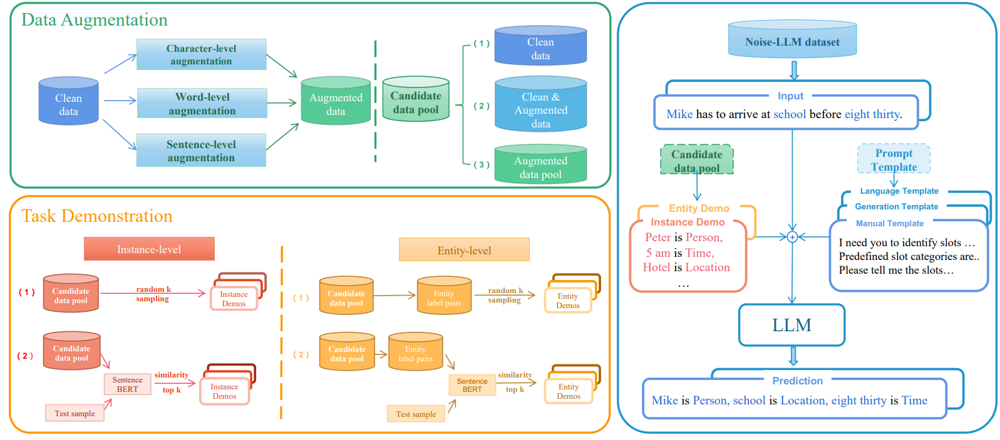

# A Unified Robustness Evaluation Framework for Noisy Slot Filling Task


## Overview

This is the repository for Noise-LLM . Noise-LLM assess how well various robustness methods of LLMs perform in real-world noisy scenarios

<div align="center"></div>

## Brief introduction

With the increasing capabilities of large language models (LLMs), these high-performance models have achieved state-of-the-art results on a wide range of natural language processing (NLP) tasks. However, the models' performance on commonly-used benchmark datasets often fails to accurately reflect their reliability and robustness when applied to real-world noisy data. 

We propose a unified robustness evaluation framework based on the slot-filling task to systematically evaluate the dialogue understanding capability of LLMs in diverse input perturbation scenarios. Specifically, we construct a input perturbation evaluation dataset, Noise-LLM, which contains five types of single perturbation and four types of mixed perturbation data. 

Furthermore, we utilize a multi-level data augmentation method (character, word, and sentence levels) to construct a candidate data pool, and carefully design two ways of automatic task demonstration construction strategies (instance-level and entity-level) with various prompt templates. Our aim is to assess how well various robustness methods of LLMs perform in real-world noisy scenarios. The experiments have demonstrated that the current open-source LLMs generally achieve limited perturbation robustness performance. 

### Evaluation by using ChatGPT API
We have provided the API code for inquiring ChatGPT. Please fill in your own API key to complete the testing locally. The Noise LLM dataset is linked in [./Noise-LLM/single-noise-raddle](./Noise-LLM/single-noise-raddle) and [./Noise-LLM/snips](./Noise-LLM/snips).

**Set up environment：**

```bash
pip install openai
```

**Evaluation:**

```bash
cd ./Noise-LLM
python chatgpt.py
```
In the future, we will improve the code for data loading to implement the automation evaluation process of Noise-LLM.


## Single Perturbation Senario

| Model                                                    |  Clean     | Typos        | Speech       | Paraphrase  | Simplification |Verbose      |Overall      |
| -------------------------------------------------------- | :------:   | :----:       | :------:     | :------:    | :------:       | :------:    | :------:    | 
| NAT                                                      |  96.01     | 67.47        | 85.23        | 87.73       | 87.32          | 85.41        | 87.21        |
| NAT                                                      |  96.04     | 67.54        | 85.16        | 87.42       | 87.33          | 85.29        | 87.27        |
| PSSAT                                                    |  96.42     | 68.34        | 85.65        | 91.54       | 89.73          | 85.82        | 88.16        |
| Text-davinci-003                                         |  43.09     | 34.26        | 39.34        | 38.42       | 40.12          | 37.18        | 38.54        |
| ChatGPT                                                  |  71.43     | 40.65        | 60.00        | 55.56       | 65.54          | 55.56        | 57.21        |
| ChatGPT+Instance level                                   | 68.21(-3.2) | 65.04(+24.3) | 70.56(+10.5) |58.82(+2.2)  | 73.02(+7.4)    |  61.77(+6.2) | 68.34(+11.1) |
| ChatGPT+Entity level                                     | 74.07(+2.6) | 62.18(+21.5) | 55.39(+4.6)  |75.59(+18.9) | 70.96(+5.4)    | 71.75(+16.1) | 71.55(+14.3) |


## Mixed Perturbation Senario

| Model                                                    |  Clean     | Typos        | Speech       | AppendIRR  | Spe+Ty         |Spe+App     |Ent+App      |Spe+App+Typ|Overall|
| -------------------------------------------------------- | :------:   | :----:       | :------:     | :------:    | :------:       | :------:    | :------:    |:------:  | :------:  |
| Text-davinci-003                                         |  31.24    | 27.18        | 23.41        | 27.48       | 19.32         | 19.78       | 20.73        | 18.84| 24.64 |
| ChatGPT                                                  |  59.65     | 42.11        | 34.83       | 45.61       | 27.58          | 31.03       | 26.38        |26.11  | 38.18 | 
| ChatGPT+Instance level                                   | 67.18     | 48.94         | 42.25       |52.61        | 34.26          |  38.79      | 38.64         | 30.67  |46.58  |
| ChatGPT+Entity level                                     | 65.71     | 47.36        | 40.37        |53.42       | 36.55          | 37.35       | 34.21      | 29.06 | 44.27 |

